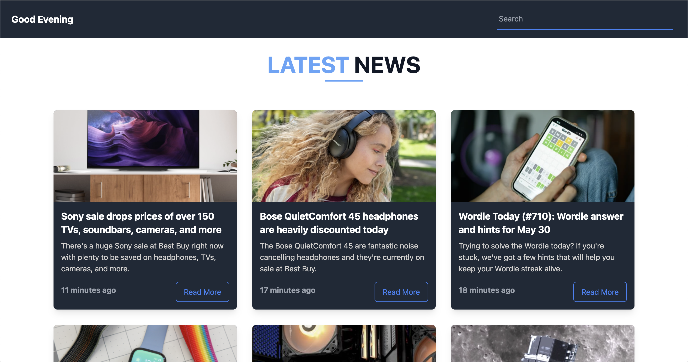

# Latest Tech News App

This is a full-stack web application that displays the latest news articles from various tech websites. The app allows users to read the latest tech news articles from popular websites without having to navigate to each website individually.

<!-- Add Image -->

## Features

- Display latest news articles from popular tech websites
- Easy to use interface
- Read articles directly from the app
- Open articles in new tab
- Search for specific articles

## Server-side Setup

1. Navigate to the project directory: `cd react-news-app/server`
2. Install dependencies: `yarn`
3. Start the server: `yarn run dev`

## Client-side Setup

1. Navigate to the project directory: `cd react-news-app/client`
2. Install dependencies: `yarn install`
3. Start the client: `yarn run dev`

## Technologies Used

- Node.js
- Express.js
- React.js
- Axios
- Moment.js
- Cheerio
- Node-Cache
- Cors
- React-icons
- Vite

## Contributing

Pull requests are welcome. For major changes, please open an issue first to discuss what you would like to change.

## License

[MIT](https://choosealicense.com/licenses/mit/)
